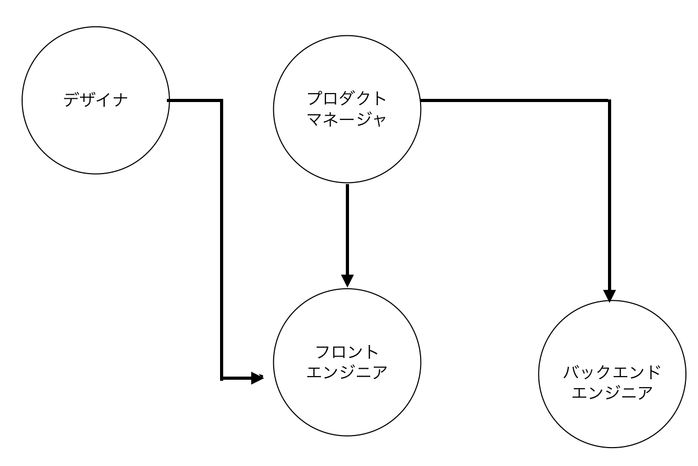

<details>
<summary>エンジニアの1日</summary>
コードを書いている時間（頭を使わない）が長いのはよくない<br>
書く前の計画で形を決める<br>

エンジニアの仕事は → 考えること（目の前の課題を解決する）

フロントエンジニアの位置付け<br>


</details>

### ◽️ ツール

⚠️ 1 つのブラウザだけでテストしても意味ない。<br>
→ 現在は mac や windows が会社に置いてあることが多い<br>
⚠️ ツールにはこだわる<br>
→ 時間の短縮などに繋がる

Mac：3 つくらい入れている（safari,firefox,chrome）

### ◽️ OS - Operating System

[ショートカット](https://support.apple.com/ja-jp/HT201236)を使う

<details><summary>知らないショートカット</summary>
・command + O：選択した項目を開きます。または、開くファイルを選択するためのダイアログが開きます。<br>
・command + T：新しいタブを開きます。<br>
・command + W：最前面のウインドウを閉じます。その App のウインドウをすべて閉じるには、「option + ・command + W」キーを押します。<br>
・command + スペース：Spotlight 検索フィールドの表示／非表示を切り替えます。
・command + shift + H：Finderのユーザーに飛ぶ
・Commandキー＋Tabキー：作業中のウィンドウ(アプリケーション)を切り替える
・contorol + 左右：
</details>

### ◽️ ターミナルアプリケーション

- GUI（Graphical User Interface）：一般的な操作画面
- CLI（Command Line Interface）：コマンドライン
  ※JavaScript あたりで使用する

### ◽️ パッケージマネージャー

・開発の時は、常にアプリを効率的にアップデートするために使用<br>
・現在入っているアプリも確認できる<br>
・MacOS の代表的なパッケージマネージャーは「Homebrew」：インストロール済み

```rb
$ brew search firefox
```

```rb
$ brew install firefox
```

#### アップデート状況確認<br>

・毎朝行うと良い

```rb
 $ brew update
```

↓ が出れば OK<br>
でない場合は一番下に出てきたテキストを打つ

```rb
 Already up-to-date.
```

⚠️ brew や winget だけを入力すると使い方が出てくるので他 OS のものは覚えなくても良い

### ◽️ コードエディタ（Visual Studio Code）

改行コードが異なる<br>
・Mac：LF（¥n）← に揃えることが多い<br>
・Windows：CRLF（¥r¥n）

改行コードを Windows と Mac で揃える設定<br>

1. Files: Eol を \n に設定<br>

2. Files: Insert Final Newline をチェック<br>
   → ファイルの最後で改行

3. Files: Trim Final Newlines をチェック<br>
   → ファイルの最後の改行を 1 つだけにする

<details><summary>VSショートカット</summary>
設定開く：command + ,<br>
インストロール画面：command + shift + x<br>
コマンドパレット：command + shift+p<br>
エクスプローラー：command + B<br>
ファイルを検索して開く：command + p<br>
</details>

#### ターミナルからエディタを開く

```rb
$ code .
```

```rb
$ code <ディレクトリまたはファイル>
```

※os のアップデートしたら再度確認

### ◽️ エディタでメモを取る

gists：メモ書きに使用できる

### +α フォルダとディレクトリの違い

フォルダ：GUI(目にみえる)<br>
ディレクトリ：CUI(主にターミナルで使う、ファイルの特殊な形)
