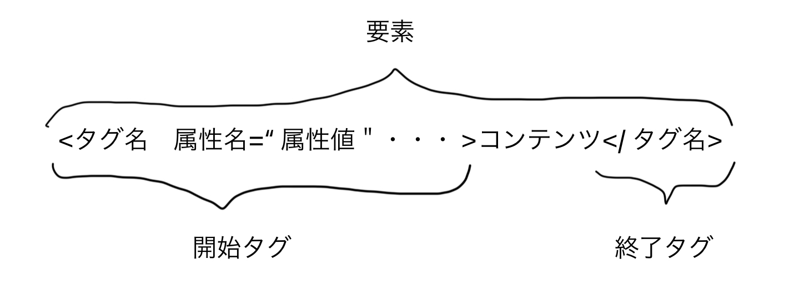

mdn web docs：Firefox を作った会社（Mozilla）<br>
Qiita：試してみた系<br>
Zenn：記事としてはしっかり書いてある。本で収益化になっているため<br>

それが正しいのか不明なためコピペはだめ！こう書くんだなんで？で深掘りする。リファレンスの時は[mdn web docs](https://developer.mozilla.org/ja/docs/Web)でしっかり公式で裏どりする。

## HTML

HTML:Hypertext[^1] Markup Language[^2] <br>
マークダウン記法:[^3]<br>
わからないことはどんどん深掘りし調べる!
[^1]:リンクがあり紐づけられているもの
[^2]:文章の構造や意味づけができるように考えられた言語
[^3]:HTML より簡略化しているため down している

WWW(World Wide Web)が最初 HTML を管理開いていたが、遅いため WHATWG(Web Hypertext Application Technology Working Group)が今 HTML の仕様を管理している<br>

### 基本的な書式と各部の名称

#### 要素（element）

<br>
・開始タグ：< と >で要素の名前が囲まれたもの<br>
・コンテンツ：要素の内容<br>
・終了タグ：</ と >で要素の名前が囲まれたもの<br>
・要素：開始タグ、コンテンツと終了タグで構成される.
< br>のようにコンテンツと終了タグが存在しない場合がある<br>

ex.HP の上<!DOCTYPE>から下< /html>までが要素。入れ子構造になっている

↪︎ 要素には前掲のように属性(attribute)を設定することができる

#### DOCTYPE 宣言

< !DOCTYPE html>ドキュメントのタイプ、文章の型宣言<br>
※大文字・小文字は区別しない

**< html>< /html>**<br>
< html>ルート要素。ページ全体を囲む

**< head>< /head>**<br>
< heaad>要素.画面に直接表示させるコンテンツではなく機械に読み取らせるものを書く

**< body>< /body>**<br>
< body>要素には画面に表示したい全てのコンテンツが含まれる

### 文字参照

| 文字  | 文字参照 | 説明         |
| :---- | :------- | :----------- |
| &     | \&amp;   | アンパサンド |
| <　　 | \&lt;    | 小なり記号   |
| >     | \&gt;    | 大なり記号   |
| "     | \&nbsp;  | 半角空白文字 |

・リンクの＆の置き換えにも \&amp; を使用<br>
・大なり小なりを置き換えるのはセキュリティ面でも必要<br>
・空白を入れても 1 区間しか空かないので\&nbsp;を入れ空白を増やす

#### コメント

```
<!--コメント記載-->
```

⚠️ ページのソースではコメントも見られてしまうので、秘密なことは書かない
