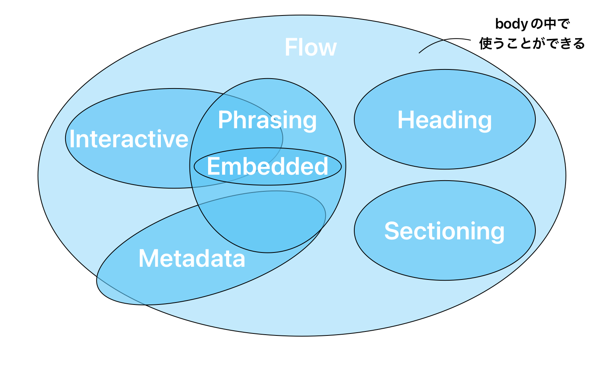
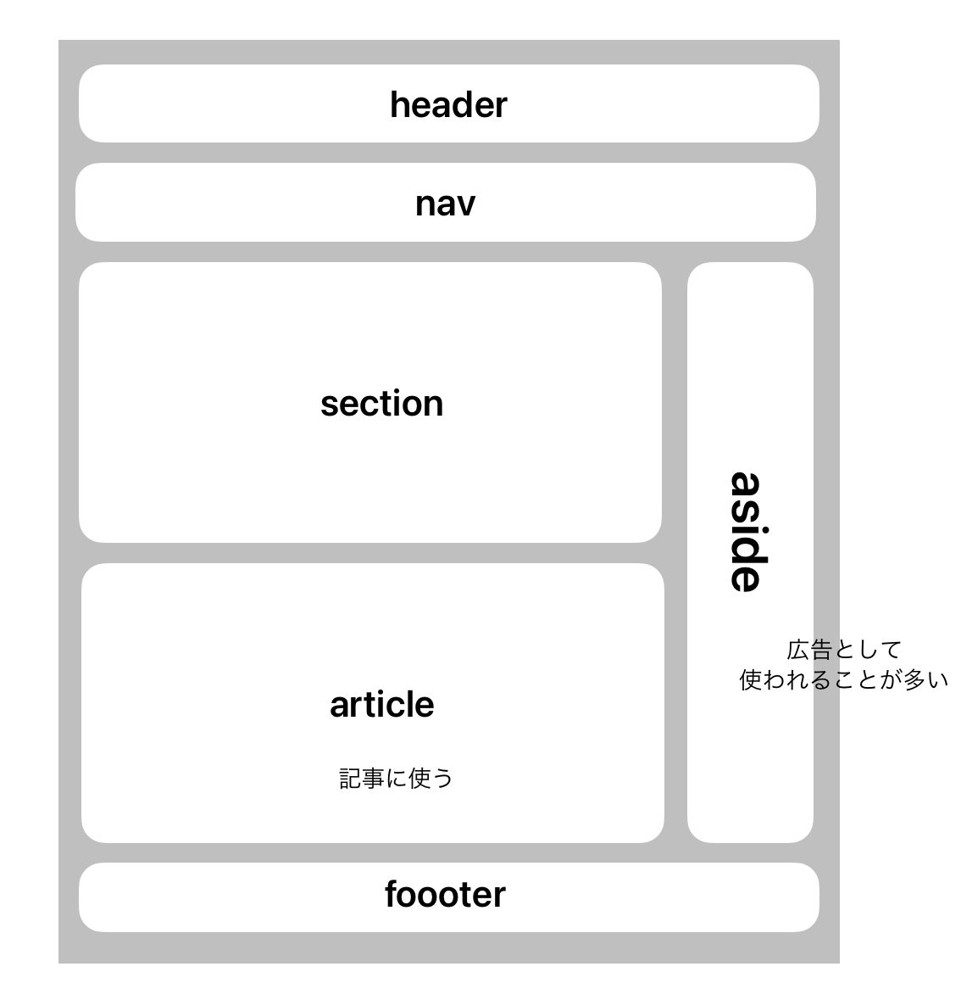

## HTML の要素とカテゴリ

### 要素の種類

使っているうちにどこの要素なのか確認しながらできれば良い<br>


<details>
<summary>メタデータコンテンツ</summary>
ページについての見た目や振る舞いなどを規定。<br>
[base,link,meta,noscript,style,template,title,base,link,meta,style]
</details>

<details>
<summary>フローコンテンツ</summary>
bodyで使用されるほとんどの要素が含まれる<br>
[ a, abbr, address, article, aside, audio, b, bdo, bdi, blockquote, br, button, canvas, cite, code, command 非推奨, data, datalist, del, details, dfn, div, dl, em, embed, fieldset, figure, footer, form, h1, h2, h3, h4, h5, h6, header, hgroup, hr, i, iframe, img, input, ins, kbd, label, main, map, mark, math, menu, meter, nav, noscript, object, ol, output, p, picture, pre, progress, q, ruby, s, samp, script, section, select, small, span, strong, sub, sup, svg, table, template, textarea, time, u, ul, var, video, wbr]
</details>

<details>
<summary>セクショニングコンテンツ</summary>
見出しとフッターの範囲を定義。意味のまとまりの要素。見るための要素<br>
[article,aside,nav,section(divの代わりで使用される)]
</details>

<details>
<summary>ヘディングコンテンツ</summary>
セクションの見出し<br>
※サイズの調整や太字で使用しない、1個飛ばして使用NG<br>
[h1,h2,h3,h4,h5,h6]<br>
 ① ③  h4以降はあまり使用しない
</details>

<details>
<summary>フレージングコンテンツ</summary>
フレーズに対して使われる要素。単語の塊。一部の単語を装飾する際に使う<br>
[a,abbr,area, （map要素内にある場合）audio,b,bdi,bdo,br,button,canvas,cite,code,data,datalist,del,dfn,em,embed,i,iframe,img,input,ins,kbd,label,link, （body要素内で利用できる場合）map,mark,
meta, （itemprop属性が指定されている場合）meter,noscript,object,output,picture,progress,q,ruby,s,samp,script,select,slot,small,span,strong,sub,sup,template,textarea,time,u,var,video,wbr]
</details>

<details>
<summary>エンベディッドコンテンツ</summary>
embed=埋め込む<br>
文章内に外部のリソース（画像・動画・音声・他のwebページ）を埋め込む<br>
[audio,canvas,embed,iframe,img,math,object,picture,svg,video]
</details>

<details>
<summary>インタラクティブコンテンツ</summary>
ユーザーが操作できるようなもの。画面の部品<br>
[a,audio,button,details,embed,iframe,img,input,label,select,textarea,video]
</details>

### レイアウト要素と基本構造

HTML は文章の構造を定義するセマンティックス要素を備えている<br>
セマンティックス･･･HTML においての意味の塊（これは見出しなのかなど）

- header - 概論や指標等の前置き的なコンテンツを表す
- nav - ナビゲーションリンクの提供を目的とするセクションを表す
- section - 汎用的（意味の塊を囲むもの）な独立した文書のセクションを表す
- article - その文書やページ内で完結するコンテンツ（ブログ記事など）を表す
- aside - 文章に直接的に関連しない情報を表す
- footer - 直近の親セクションのフッターを表す
- details - 詳細情報を含む展開ウィジェットを生成する
- summary - details 要素の内容の要約、キャプション、説明、凡例を表す

良く見られる web サイトの構成 ⇩ <br>
<br>

セマンティック要素を適切に使用することにより以下のメリットがある<br>

- SEO：検索エンジンの最適化（キーワードとの関連度合いを高める。）
- アクセシビリティ：インクルーシブであること、スクリーンリーダー（目の不自由な人には音声で流れるのでわかりやすいように）<br>
  ⚠️ 要素を正しい意味で使用する。全て div はだめ

テキスト・フォーム要素・テーブル要素に関しては
[HTML 要素リファレンス
](https://developer.mozilla.org/ja/docs/Web/HTML/Element)で確認！

### グローバル属性

`class 属性`<br>
CSS で利用する、JS でも使用する。クラス属性は空白（半角）区切りで複数してできる

`id 属性`<br>
1 つだけしか指定できない。また、同じ値を複数出してはいけない

`lang 属性`<br>
言語の指定（一部分だけ変えることも可能）

`title 属性`<br>
ツールチップがつく（カーソルを合わせると吹き出しが出る）
ex.HELP の表示等

`dir 属性`<br>
左から右が基本だが右から左に変更できる（アラビア語など）<br>
↪︎ltr（left to right）、rtl（right to left）、auto が指定可能

```
例 <p dir="rtl">右から左になる</p>
```

`tabindex 属性`<br>
Tab キーによってフォーカスを移動することを許可や防止、移動順を指定できる

`dropzone 属性`<br>
ドラッグされたアイテムドロップされた時、アイテムのコピー、移動、リンク作成を許可するかを指定

`カスタムデータ(data-*) 属性`<br>
文章にプライベートなカスタムデータ、状態、注釈などを保持し、固有のスクリプトによる処理などで使用できる。自分たちで自由に属性を追加できる。<br>

JS で読み込み数値処理などに利用<br>
例 data-price="1000"

`(aria-*) 属性`<br>
アクセシビリティをよくするもの。スクリーンリーダーで動きが変わる（通常画面上ではわからない）
